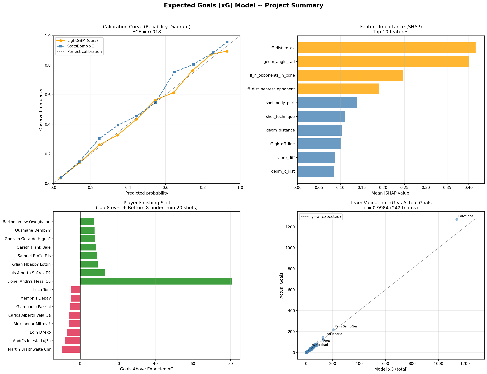

# Expected Goals (xG) Model & Player Scouting Framework

Build an xG model from scratch using StatsBomb Open Data, then use it to identify
clinical finishers and wasteful shooters across 65,000+ shots.



---

## Results

### Model Performance (test set, n=13,143 shots)

| Metric | LightGBM | Baseline LR | StatsBomb xG |
|---|---|---|---|
| **Log-loss** | **0.2487** | 0.2489 | 0.2546 |
| **Brier score** | **0.0711** | 0.0712 | 0.0724 |
| **ROC-AUC** | 0.8346 | 0.8349 | 0.8245 |

- Both models beat StatsBomb xG by ~2.3% on log-loss.
- LightGBM ECE = 0.018 (well-calibrated, no post-hoc correction needed).
- Match-based train/test split (zero match overlap) prevents data leakage.

### SHAP Feature Importance (Top 5)

| Rank | Feature | Mean |SHAP| |
|---|---|---|
| 1 | Distance to goalkeeper | 0.416 |
| 2 | Angle to goal (radians) | 0.400 |
| 3 | Opponents in shot cone | 0.246 |
| 4 | Distance to nearest opponent | 0.190 |
| 5 | Shot body part | 0.139 |

### Scouting Highlights

**Top overperformers** (goals above xG, min 20 shots):

| Player | Shots | Goals | xG | Goals - xG |
|---|---|---|---|---|
| Messi | 2,583 | 442 | 361.4 | **+80.6** |
| Suarez | 628 | 132 | 118.7 | +13.3 |
| Mbappe | 294 | 55 | 45.7 | +9.3 |

**Team-level validation**: model xG vs actual goals correlation r=0.9956 (130 teams).

---

## Project Architecture

```
XG_PROJE/
|-- data/                    # Parquet datasets (not in git)
|   |-- shots_raw.parquet    # 65,822 shots x 33 cols (raw extraction)
|   |-- shots_features.parquet  # 65,822 x 49 cols (engineered features)
|
|-- src/                     # Core modular packages
|   |-- features/            # Feature engineering
|   |   |-- geometry.py      # Distance, angle, box check
|   |   |-- freeze_frame.py  # Defender/GK positional features
|   |   |-- transformers.py  # Sklearn-compatible transformers
|   |   |-- pipeline.py      # Column lists, pipeline builder
|   |-- models/              # Model definitions
|   |   |-- baseline.py      # Logistic Regression pipeline
|   |   |-- gradient_boosting.py  # LightGBM + CV tuning + calibration
|   |-- preprocess/          # Data utilities
|   |   |-- splitter.py      # Match-based stratified train/test split
|   |-- evaluation/          # Metrics and plots
|   |   |-- metrics.py       # Log-loss, Brier, AUC, calibration curve
|   |-- scouting/            # Player/team analysis
|       |-- player_analysis.py  # Per-player xG aggregation + confidence bands
|       |-- team_analysis.py    # Attack/defense over-under performance
|
|-- scripts/                 # Executable entry points
|   |-- extract_shots.py     # Fetch StatsBomb data -> shots_raw.parquet
|   |-- build_features.py    # Apply transformers -> shots_features.parquet
|   |-- train.py             # Train baseline LR
|   |-- train_gbm.py         # Train LightGBM + SHAP + calibration
|   |-- validate.py          # Shot/team/player correlation + error analysis
|   |-- scouting.py          # Full scouting report generation
|
|-- models/                  # Saved models (not in git)
|-- reports/                 # Generated plots, CSVs, JSONs
|-- notebooks/               # EDA and exploration only
|-- docs/                    # Phase plans and tracking
```

---

## How to Run

### Setup

```bash
python -m venv env
# Windows
env\Scripts\activate
# Linux/Mac
source env/bin/activate

pip install -r requirements.txt
```

### Pipeline (execute in order)

```bash
# 1. Extract shots from StatsBomb Open Data (~15 min, parallel fetch)
python scripts/extract_shots.py

# 2. Engineer features (geometry + freeze frame, ~3 sec)
python scripts/build_features.py

# 3. Train baseline Logistic Regression
python scripts/train.py

# 4. Train LightGBM with CV tuning + SHAP (~2 min)
python scripts/train_gbm.py

# 5. Validation: shot/team/player correlation + error analysis
python scripts/validate.py

# 6. Scouting: player and team rankings
python scripts/scouting.py
```

### Interactive Dashboard

After the pipeline has produced the model and reports, launch the Streamlit app:

```bash
streamlit run app.py
```

The dashboard exposes the model performance, SHAP analysis, and the player/team
scouting tables interactively.

---

## Feature Engineering

### Geometric features (from shot location)
- Euclidean distance to goal center
- Angle subtended by goalposts (radians + degrees)
- X/Y distances to goal line / goal center
- Inside penalty box flag

### Freeze-frame features (player positions at shot moment)
- Number of opponents in shot cone (triangle: shot -> both posts)
- Opponents within 3m / 5m radius
- Distance to nearest opponent
- Goalkeeper distance + off-line measure + lateral offset
- Teammates in box

### Extended features
- Native StatsBomb flags: open_goal, one_on_one, first_time, deflected, follows_dribble, aerial_won, redirect
- Key pass attributes: cross, cutback, through_ball, pass length/angle
- Game state: running score difference at shot moment

---

## Key Design Decisions

1. **No leakage**: `statsbomb_xg` is NEVER used as a feature -- only for benchmarking.
2. **Match-based split**: shots from the same match stay in the same set.
3. **Calibration over accuracy**: log-loss and Brier score are primary metrics, not accuracy (~10% positive rate makes accuracy misleading).
4. **No class weighting**: preserves probability calibration (class_weight distorts P(goal)).
5. **Penalties excluded**: fixed ~0.76 xG, not informative.
6. **Full OOP architecture**: every component is a reusable class or function.

---

## Tech Stack

- **Data**: statsbombpy, pandas, pyarrow
- **ML**: scikit-learn, LightGBM
- **Interpretability**: SHAP (TreeExplainer)
- **Visualization**: matplotlib, seaborn
- **Dashboard**: Streamlit, Plotly
- **Data source**: [StatsBomb Open Data](https://github.com/statsbomb/open-data)

---

## Detailed Walkthrough (Turkish)

A comprehensive Turkish-language document explaining every design decision and its
alternatives -- intended as a learning resource for junior data scientists:
[docs/egitim_dokumani.md](docs/egitim_dokumani.md).

---

## Reports Generated

| File | Description |
|---|---|
| `reports/baseline_calibration.png` | LR calibration curve vs StatsBomb |
| `reports/lgbm_calibration.png` | LightGBM calibration curve (3-way) |
| `reports/lgbm_shap_summary.png` | SHAP beeswarm plot |
| `reports/shot_correlation.png` | Model vs StatsBomb shot-level scatter |
| `reports/team_aggregation.png` | Team xG vs actual goals |
| `reports/scouting_top_players.png` | Over/underperformer bar chart |
| `reports/scouting_team_scatter.png` | Team attack/defense dashboard |
| `reports/scouting_players.csv` | Full player table (878 players) |
| `reports/scouting_teams.csv` | Full team table (242 teams) |
| `reports/project_summary.png` | 4-panel visual dashboard |
